# Dokumentacja

## Temat - System do zarządzania małym hotelem/airbnb

Kacper Kotkiewicz

## Wykorzystane technologie

- SZBD: Oracle
- Język Backendu: Kotlin
- Framework Rest: SpringBoot
- Framework do obsługi bazy danych: Hibernate

## 1. Schemat Bazy

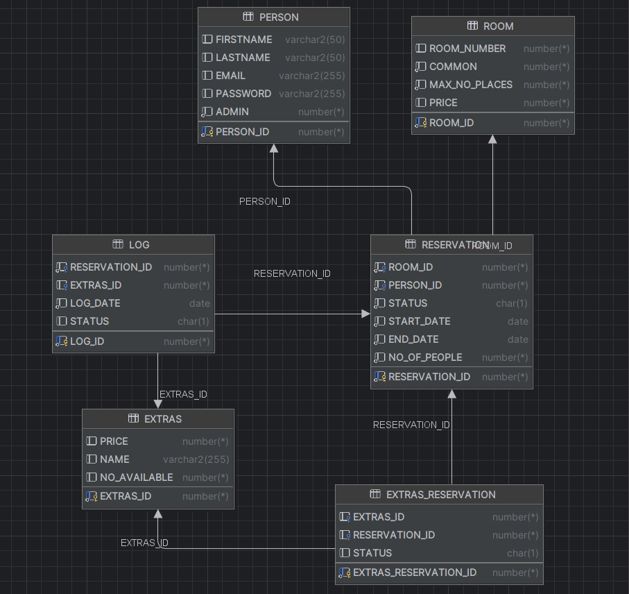

## 2. Tabele

### 2.1 Room

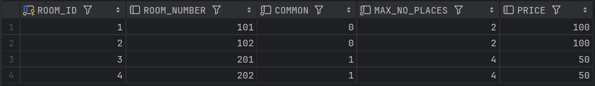

Reprezenuje pokój w hotelu - posiada id, numer pokoju, informację czy pokój jest współdzielony (jeżeli pokój jest współdzielony to można zrobić na nim kilka rezerwacji zamiast jednej), liczba miejsc w pokoju i cena za noc.

### 2.2 Person

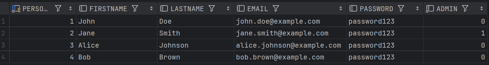

Reprezentuje dane o koncie osoby korzystającej z aplikacji.

### 2.3 Reservation

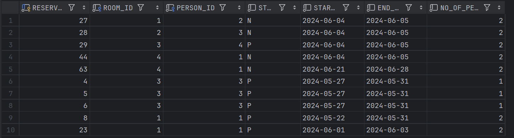

Przechowuje informacje o rezerwacji, posiada FK na Person oraz pokój, pokazuje również dane o dacie startu i końca rezerwacji, liczbie osób w rezerwacji oraz status rezerwacji ('P' - paid, 'N' - new, 'C' - canceled).

### 2.4 Extras

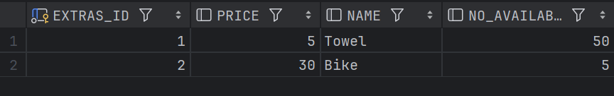

Reprezentuje dodatkowe udogodnienia, które można dokupić do rezerwacji.

### 2.5 Extras_Reservation

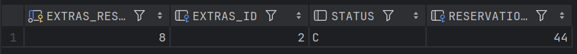

Przechowuje o rezerwacjach na dodatkowe udogodnienia (FK na Reservation oraz Extras).

### 2.6 Log

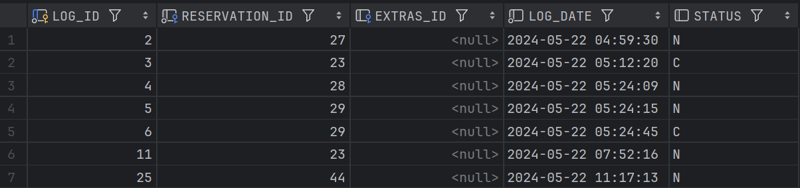

Przechowuje dane o zmianach w bazie (dodanie nowej rezerwacji lub zmiana statusu)

## 3. Obiekty i Kolekcje

### 3.1 EXTRAS_DETAILS

```sql
create or replace type extras_details
as object
(
    extras_id int,
    extras_name string,
    extras_number int,
    price int
)
```

Służy do prezentowania informacji o dostępnych udogodnieniach dla danej rezerwacji (extras, które można jeszcze dokupić).

### 3.2 EXTRAS_INFO

```sql
create type extras_info
as object
(
    extras_reservation_id int,
    extras_id int,
    extras_name varchar2(255),
    st char,
    price int
)
```

Używany do raportowania o rezerwacji udogodnienia.

### 3.3 ROOM_DETAILS

```sql
create type room_details
as object
(
    room_id int,
    room_number int,
    common int,
    price int,
    max_no_places int,
    available_places int
)
```

Informacje o dostępnych pokojach.

### 3.4 EXTRAS_DETAILS_ARRAY

```sql
create type EXTRAS_DETAILS_ARRAY as table of EXTRAS_DETAILS
```

### 3.5 EXTRAS_INFO_ARRAY

```sql
create type EXTRAS_INFO_ARRAY as table of EXTRAS_INFO
```

### 3.6 ROOM_DETAILS_ARRAY

```sql
create type ROOM_DETAILS_ARRAY as table of ROOM_DETAILS
```

### 3.7 NUM_ARRAY

```sql
create type NUM_ARRAY as table of INTEGER
```

## 4. Funkcje

### 4.1 F_ROOM_EXISTS

```sql
create function f_room_exists(room_id_check room.room_id%type)
    return number
as
    result number;
begin
    select count(room_id) into result from room where room_id = room_id_check;

    if result is null then
        result := 0;
    end if;

    return result;
end;
```

Sprawdzanie, czy pokój o podanym id istnieje.

### 4.2 F_PERSON_EXISTS

```sql
create or replace function f_person_exists(person_id_check person.person_id%type)
    return number
as
    person_exist int;
begin
    if person_id_check is null then
        raise_application_error(-20001, 'Parameter person_id_check cannot be null');
    end if;
    select count(person_id) into person_exist from person;

    if person_exist is null then
        return 0;
    end if;

    return person_exist;
end;
```

Sprawdzanie, czy osoba o podanym id istnieje.

### 4.3 F_RESERVATION_EXISTS

```sql
create or replace function f_reservation_exists(reservation_id_check reservation.RESERVATION_ID%TYPE)
    return number
as
    reservation_exists int;
begin
    if reservation_id_check is null then
        raise_application_error(-2001, 'Parameter reservation_id_check cannot be null');
    end if;
    select count(r.reservation_id) into reservation_exists from reservation r where r.reservation_id = reservation_id_check;

    if reservation_exists is null then
        return 0;
    end if;

    return reservation_exists;
end;
```

Sprawdzanie, czy rezerwacja o podanym id istnieje.

### 4.4 F_EXTRAS_EXISTS

```sql
create function f_extras_exists(extras_id_check extras.extras_id%type)
    return number
as
    result number;
begin
    select count(extras_id) into result from EXTRAS where EXTRAS_ID = extras_id_check;

    if result is null then
        result := 0;
    end if;

    return result;
end;
```

Sprawdzanie, czy udogodnienie o podanym id istnieje.

### 4.5 F_EXTRAS_RESERVATION_EXISTS

```sql
create function f_extras_reservation_exists(extras_reservation_id_check extras_reservation.extras_reservation_id%type)
    return number
as
    result number;
begin
    select count(extras_reservation_id) into result from EXTRAS_RESERVATION where EXTRAS_ID = extras_reservation_id_check;

    if result is null then
        result := 0;
    end if;

    return result;
end;
```

Sprawdzanie, czy rezerwacja na udogodnienie o podanym id istnieje.

### 4.6 F_ROOM_IS_COMMON

```sql
create function f_room_is_common(room_id_check ROOM.ROOM_ID%TYPE)
    RETURN number
as
    result number;
begin
    select common into result from room where room_id = room_id_check;
    return result;
end;
```

Sprawdzanie, czy pokój o podanym id jest współdzielony.

### 4.7 F_ROOM_OCCUPIED

```sql
create or replace function f_room_occupied(room_id_check ROOM.ROOM_ID%TYPE, date_from date, date_to date)
    RETURN number
as
    result number;
begin
    select count(r.RESERVATION_ID) into result
    from reservation r
    where r.ROOM_ID = room_id_check
      and r.START_DATE <= date_to
      and r.END_DATE >= date_from
      and r.STATUS != 'C';

    if result is null then
        return 0;
    end if;

    return result;
end;
```

Sprawdzanie, czy pokój o podanym id jest zajęty w podanym przedziale czasowym.

### 4.8 F_COMMON_ROOM_AVAILABLE_PLACES

```sql
create or replace function f_common_room_available_places(room_id_check ROOM.ROOM_ID%TYPE, date_from date, date_to date)
    RETURN number
as
    occupied_places number;
    max_occupied_places number;
begin
    select SUM(r.NO_OF_PEOPLE) into occupied_places
      from reservation r
     where r.ROOM_ID = room_id_check
       and r.START_DATE <= date_to
       and r.END_DATE >= date_from
       and r.STATUS != 'C';
    select MAX_NO_PLACES into max_occupied_places from room where ROOM_ID = room_id_check;

    if occupied_places is null then
        return max_occupied_places;
    end if;

    return max_occupied_places - occupied_places;
end;
```

Sprawdzanie, ile miejsc dostępnych zostało w pokoju współdzielonym.

### 4.9 F_EXTRAS_AVAILABLE

```sql
create function f_extras_available(extras_id_check extras.extras_id%type, date_from date, date_to date)
return number
as
    max_available_extras number;
    occupied_extras number;
    result number;
begin
    select NO_AVAILABLE into max_available_extras from EXTRAS where EXTRAS_ID = extras_id_check;
    select sum(r.NO_OF_PEOPLE) into occupied_extras from EXTRAS_RESERVATION er
       inner join RESERVATION R on R.RESERVATION_ID = er.RESERVATION_ID
       where er.EXTRAS_ID = extras_id_check
         and r.START_DATE <= date_to
         and r.END_DATE >= date_from
         and r.status != 'C';

    if occupied_extras is null then
        return max_available_extras;
    end if;

    result := max_available_extras - occupied_extras;

    return result;
end;
```

Sprawdza czy udogodnienie jest dostępne w podanym przedziale czasowym.

### 4.10 F_GET_RESERVATION_PRICE

```sql
create or replace function f_get_reservation_price(reservation_id_check RESERVATION.reservation_id%type)
    return number
as
    no_of_people number;
    extras_price number;
    room_price number;
    date_from date;
    date_to date;
    day_count number;
    final_price number;
begin
    select END_DATE, START_DATE into date_to, date_from from RESERVATION where RESERVATION_ID = reservation_id_check;
    select sum(e.PRICE) into extras_price from EXTRAS_RESERVATION er INNER JOIN EXTRAS e on e.EXTRAS_ID = er.EXTRAS_ID where er.RESERVATION_ID = reservation_id_check;
    select r.PRICE, reservation.NO_OF_PEOPLE into room_price, no_of_people  from RESERVATION inner join BD_411400.ROOM R on R.ROOM_ID = RESERVATION.ROOM_ID where RESERVATION_ID = reservation_id_check;

    day_count := date_to - date_from;

    if extras_price is null then
        final_price := day_count * room_price;
        return final_price;
    end if;

    final_price := extras_price * no_of_people + day_count * room_price;
    return final_price;
end;
```

Oblicza cenę rezerwacji (cena pokoju oraz cena udogodnień).

### 4.11 F_SAME_EXTRA_RESERVATION_EXISTS

```sql
create or replace function f_same_extra_reservation_exists(r_id RESERVATION.RESERVATION_ID%type, e_id EXTRAS.EXTRAS_ID%type)
return number
as
    result number;
begin
    select count(*) into result from EXTRAS_RESERVATION
     where EXTRAS_ID = e_id and RESERVATION_ID = r_id;

    if result is null then
        result := 0;
    end if;

    return result;
end;
```

Sprawdza, czy rezerwacja na udogodnienie już istnieje (po podaniu FK), żeby nie tworzyć nowej rezerwacji na tę samą rzecz.

### 4.12 F_GET_PERSON_RESERVATION_IDS

```sql
create function f_get_person_reservation_ids(p_id person.person_id%type)
return NUM_ARRAY
as
    result NUM_ARRAY;
begin
    select reservation_id bulk collect into result
      from reservation where person_id = p_id;

    return result;
end;
```

Zwraca tablicę reservation_id, które zrobiła osoba o danym id.

### 4.13 F_AVAILABLE_ROOMS

```sql
create or replace FUNCTION f_available_rooms(date_from DATE, date_to DATE)
    RETURN room_details_array
AS
    result room_details_array := room_details_array();
    CURSOR available_rooms_cursor IS
        WITH ReservedRooms AS (
            SELECT
                r.ROOM_ID,
                SUM(r.NO_OF_PEOPLE) AS OCCUPIED_PLACES
            FROM
                BD_411400.RESERVATION r
            WHERE
                r.START_DATE < date_to
              AND r.END_DATE > date_from
              and r.STATUS != 'C'
            GROUP BY
                r.ROOM_ID
        )
        SELECT
            rm.ROOM_ID,
            rm.ROOM_NUMBER,
            rm.COMMON,
            rm.PRICE,
            rm.MAX_NO_PLACES,
            CASE
                WHEN rm.COMMON = 1 THEN (rm.MAX_NO_PLACES - NVL(rr.OCCUPIED_PLACES, 0))
                END AS AVAILABLE_PLACES
        FROM
            BD_411400.ROOM rm
                LEFT JOIN ReservedRooms rr ON rm.ROOM_ID = rr.ROOM_ID
        WHERE
            rr.ROOM_ID IS NULL
           OR (rm.COMMON = 1 AND (rm.MAX_NO_PLACES - NVL(rr.OCCUPIED_PLACES, 0)) > 0);
BEGIN
    FOR room_record IN available_rooms_cursor LOOP
            result.EXTEND;
            result(result.COUNT) := room_details(
                    room_record.ROOM_ID,
                    room_record.ROOM_NUMBER,
                    room_record.COMMON,
                    room_record.PRICE,
                    room_record.MAX_NO_PLACES,
                    room_record.AVAILABLE_PLACES
                                    );
        END LOOP;

    RETURN result;
END;
```

Zwraca listę dostępnych pokoi w podanym przedziale czasowym.

### 4.14 F_GET_RESERVATION_EXTRAS

```sql
create function f_get_reservation_extras(r_id reservation.reservation_id%type)
    return extras_info_array
as
    extras_information EXTRAS_INFO_ARRAY;
begin

    select extras_info(extras_reservation_id, extras_id, name, price, status) bulk collect into extras_information
    from (select er.extras_reservation_id, e.extras_id, e.name, e.price, er.STATUS from EXTRAS_RESERVATION er
                                                                                            inner join EXTRAS E on E.EXTRAS_ID = er.EXTRAS_ID
          where er.RESERVATION_ID = r_id);

    return extras_information;
end;
```

Zwraca tablicę informacji o udogodnieniach powiązanych z rezerwacją pokoju o podanym id.

### 4.15 F_RESERVATION_EXTRAS_AVAILABLE

```sql
create function f_reservation_extras_available(reservation_id_check reservation.RESERVATION_ID%type)
    return extras_details_array
as
    extras_info extras_details_array;
    date_from date;
    date_to date;
    no_places int;
begin
    if F_RESERVATION_EXISTS(reservation_id_check) = 0 then
        raise_application_error(-20001, 'Reservation with this id does not exist');
    end if;

    select START_DATE, END_DATE, NO_OF_PEOPLE into date_from, date_to, no_places
      from RESERVATION where RESERVATION_ID = reservation_id_check;

    select extras_details(EXTRAS_ID, NO_AVAILABLE, PRICE)
            bulk collect into extras_info
    from (
         select E.EXTRAS_ID, E.NO_AVAILABLE - NVL(SUM(R.NO_OF_PEOPLE), 0) as NO_AVAILABLE, E.PRICE
         from EXTRAS E
                  left join EXTRAS_RESERVATION ER on E.EXTRAS_ID = ER.EXTRAS_ID
                  left join RESERVATION R on ER.RESERVATION_ID = R.RESERVATION_ID
             and ER.STATUS = 'N'
             and R.RESERVATION_ID != reservation_id_check
             and ((R.START_DATE between date_from and date_to) or (R.END_DATE between date_from and date_to))
         group by E.EXTRAS_ID, E.NO_AVAILABLE, E.PRICE
         having E.NO_AVAILABLE - NVL(SUM(R.NO_OF_PEOPLE), 0) >= no_places
     );

    return extras_info;
end;
```

Zwraca tablicę informacji o dostępnych udogonieniach dla rezerwacji pokoju.

## 5. Procedury

### 5.1 P_ADD_ADMIN

```sql
create procedure p_add_admin(fn person.firstname%type, ln person.lastname%type,
    email person.email%type, password person.password%type)
as
begin
    insert into person (FIRSTNAME, LASTNAME, EMAIL, PASSWORD, admin)
    VALUES (fn, ln, email, password, 1);
end;
```

Procedura dodania do tablicy Person użytkownika o prawach administratora.

### 5.2 P_ADD_USER

```sql
create procedure p_add_user(fn person.firstname%type, ln person.lastname%type,
    email person.email%type, password person.password%type)
as
begin
    insert into person (FIRSTNAME, LASTNAME, EMAIL, PASSWORD)
    VALUES (fn, ln, email, password);
end;
```

Procedura dodania do tablicy Person użytkownika bez praw administratora.

### 5.3 P_PAY_FOR_RESERVATION

```sql
create or replace procedure p_pay_for_reservation(r_id RESERVATION.reservation_id%type)
as
    st char;
begin
    if r_id is null then
        raise_application_error(-20001, 'Reservation id cannot be null');
    end if;

    select status into st from reservation where reservation_id = r_id;

    if st = 'C' then
        raise_application_error(-20002, 'Cannot pay for canceled reservation');
    end if;

    if st = 'P' then
        raise_application_error(-20003, 'Cannot pay for paid reservation');
    end if;

    update reservation set status = 'P' where RESERVATION_ID = r_id;
    update EXTRAS_RESERVATION er set er.STATUS = 'P'
     where er.RESERVATION_ID = r_id and er.STATUS != 'C';
end;
```

Procedura aktualizująca status rezerwacji na zapłaconą.

### 5.4 P_CANCEL_RESERVATION

```sql
create procedure p_cancel_reservation(r_id RESERVATION.reservation_id%type)
as
    st char;
begin
    if r_id is null then
        raise_application_error(-20001, 'Reservation id cannot be null');
    end if;

    select status into st from reservation where reservation_id = r_id;

    if st = 'C' then
        raise_application_error(-20002, 'Cannot cancel reservation that is already canceled');
    end if;

    update reservation set status = 'C' where RESERVATION_ID = r_id;
    update EXTRAS_RESERVATION er set er.STATUS = 'C'
     where er.RESERVATION_ID = r_id;
end;
```

Procedura aktualizująca status rezerwacji na anulowaną.

### 5.5 P_RESTORE_RESERVATION

```sql
create procedure p_restore_reservation(r_id RESERVATION.reservation_id%type)
as
    st char;
    rid int;
    ppl int;
    sd date;
    ed date;
begin
    if r_id is null then
        raise_application_error(-20001, 'Reservation id cannot be null');
    end if;

    select status into st from reservation where reservation_id = r_id;
    select ROOM_ID into rid from reservation where reservation_id = r_id;
    select NO_OF_PEOPLE into ppl from reservation where reservation_id = r_id;
    select START_DATE into sd from RESERVATION where RESERVATION_ID = r_id;
    select END_DATE into ed from RESERVATION where RESERVATION_ID = r_id;

    if st = 'N' or st = 'P' then
        raise_application_error(-20002, 'Reservation is not cancel');
    end if;

    if F_ROOM_IS_COMMON(rid) = 1 then
        if F_COMMON_ROOM_AVAILABLE_PLACES(rid, sd, ed) < ppl then
            raise_application_error(-20002, 'Not enough places in room');
        end if;
    end if;

    if F_ROOM_IS_COMMON(rid) = 0 then
        if F_ROOM_OCCUPIED(rid, sd, ed) = 1 then
            raise_application_error(-20003, 'Room already occupied');
        end if;
    end if;

    update reservation set status = 'N' where RESERVATION_ID = r_id;
end;
```

Procedura aktualizująca status rezerwacji na nową.

### 5.6 P_ADD_RESERVATION

```sql
create procedure p_add_reservation(rm_id room.room_id%type, pn_id person.person_id%type,
                date_from date, date_to date, no_people number)
as
begin
    insert into RESERVATION (ROOM_ID, PERSON_ID, STATUS, START_DATE, END_DATE, NO_OF_PEOPLE)
    values (rm_id, pn_id, 'N', date_from, date_to, no_people);
end;
```

Procedura do dodawania rezerwacji.

### 5.7 P_ADD_EXTRAS_RESERVATION

```sql
create or replace procedure p_add_extras_reservation(ex_id extras.extras_id%type, r_id reservation.reservation_id%type)
as
    date_from date;
    date_to date;
    people_number number;
begin

    select R.START_DATE, R.END_DATE, R.NO_OF_PEOPLE
     into date_from, date_to, people_number from RESERVATION R
    where R.RESERVATION_ID = r_id;

    if F_EXTRAS_AVAILABLE(ex_id, date_from, date_to) < people_number then
        raise_application_error(-20003, 'Extras already occupied');
    end if;

    if F_SAME_EXTRA_RESERVATION_EXISTS(r_id, ex_id) != 0 then
        update EXTRAS_RESERVATION set STATUS = 'N'
        where RESERVATION_ID = r_id and extras_id = ex_id;
    end if;

    if F_SAME_EXTRA_RESERVATION_EXISTS(r_id, ex_id) = 0 then
        insert into EXTRAS_RESERVATION (EXTRAS_ID, RESERVATION_ID, STATUS)
        VALUES (ex_id, r_id, 'N');
    end if;
end;
```

Procedura do dodawania rezerwacji na udogodnienia.

### 5.8 P_CANCEL_EXTRAS_RESERVATION

```sql
create procedure p_cancel_extras_reservation(exr_id EXTRAS_RESERVATION.EXTRAS_RESERVATION_ID%type)
as
    st char;
begin
    if exr_id is null then
        raise_application_error(-20001, 'Extras reservation id cannot be null');
    end if;

    select status into st from extras_reservation where extras_reservation_id = exr_id;

    if st = 'C' then
        raise_application_error(-20002, 'Cannot cancel reservation that is already canceled');
    end if;

    update EXTRAS_RESERVATION set status = 'C' where EXTRAS_RESERVATION_ID = exr_id;
end;
```

Procedura do aktualizowania statusu rezerwacji na udogodnienia na anulowaną.

## 6. Triggery

### 6.1 RESERVATION

#### 6.1.1 T_ADD_LOG_MODIFY_RESERVATION_STATUS

```sql
create or replace trigger T_ADD_LOG_MODIFY_RESERVATION_STATUS
    after update
    on RESERVATION
    for each row
begin
    if :NEW.status = 'C' then
        update EXTRAS_RESERVATION set STATUS = 'C' where RESERVATION_ID = :NEW.RESERVATION_ID;
    end if;

    insert into log (RESERVATION_ID, LOG_DATE, STATUS)
    values (:NEW.RESERVATION_ID, SYSDATE, :NEW.STATUS);
end;
```

Po aktualizowaniu rezerwacji dodaje wpis w tabeli Log.

#### 6.1.2 T_ADD_RESERVATION

```sql
create or replace trigger T_ADD_RESERVATION
    before insert
    on RESERVATION
    for each row
declare
begin
    if f_room_exists(:new.ROOM_ID) = 0 then
        raise_application_error(-20001, 'There is no room with given id');
    end if;

    if f_person_exists(:new.person_id) = 0 then
        raise_application_error(-20004, 'There is no person with given id');
    end if;

    if :NEW.START_DATE >= :NEW.END_DATE or :NEW.START_DATE < SYSDATE then
        raise_application_error(-20005, 'Wrong date given');
    end if;

    if f_room_is_common(:NEW.ROOM_ID) = 1 then
        if f_common_room_available_places(:new.ROOM_ID, :new.START_DATE, :new.END_DATE) < :new.NO_OF_PEOPLE then
            raise_application_error(-20002, 'Not enough places in this room');
        end if;
    end if;

    if f_room_occupied(:new.ROOM_ID, :new.START_DATE, :new.END_DATE) = 1 then
        raise_application_error(-20003, 'Room is already occupied on this date');
    end if;
end;
```

Waliduje dane podczas dodawania rezerwacji.

#### 6.1.3 T_LOG_AFTER_ADD_RESERVATION

```sql
create or replace trigger T_LOG_AFTER_ADD_RESERVATION
    after insert
    on RESERVATION
    for each row
declare
begin
    insert into log (RESERVATION_ID, LOG_DATE, STATUS) values (:new.reservation_id, sysdate, :new.status);
end;
```

Po dodaniu rezerwacji dodaje wpis w tabeli Log.

#### 6.1.4 T_MODIFY_RESERVATION_STATUS

```sql
create trigger T_MODIFY_RESERVATION_STATUS
    before update
    on RESERVATION
    for each row
declare
    room_places number;
begin
    if (:OLD.status != :NEW.status) then
        if :OLD.status = 'P' then
            raise_application_error(-20001, 'Cannot cancel paid room');
        end if;
    end if;
end;
```

Waliduje dane podczas zmiany statusu rezerwacji.

#### 6.1.5 T_PREVENT_DELETE_RESERVATION

```sql
create trigger T_PREVENT_DELETE_RESERVATION
    before delete
    on RESERVATION
    for each row
begin
    raise_application_error(-20001, 'Cannot remove reservation from database');
end;
```

Nie pozwala na usunięcie rezerwacji.

### 6.2 EXTRAS_RESERVATION

#### 6.2.1 T_ADD_EXTRAS_RESERVATION

```sql
CREATE OR REPLACE TRIGGER BD_411400.T_ADD_EXTRAS_RESERVATION
    BEFORE INSERT
    ON BD_411400.EXTRAS_RESERVATION
    FOR EACH ROW
DECLARE
    date_from DATE;
    date_to DATE;
    no_of_extras NUMBER;
    r_st char;
BEGIN
    IF BD_411400.f_reservation_exists(:new.RESERVATION_ID) = 0 THEN
        RAISE_APPLICATION_ERROR(-20001, 'There is no reservation with the given ID');
    END IF;

    IF BD_411400.f_extras_exists(:new.EXTRAS_ID) = 0 THEN
        RAISE_APPLICATION_ERROR(-20004, 'There is no extras with the given ID');
    END IF;

    SELECT r.START_DATE, r.END_DATE, r.NO_OF_PEOPLE, r.STATUS
    INTO date_from, date_to, no_of_extras, r_st
    FROM BD_411400.RESERVATION r
    WHERE r.RESERVATION_ID = :new.RESERVATION_ID;

    if r_st != 'N' then
        raise_application_error(-20006, 'Cannot add extras to paid or canceled reservation');
    end if;

    IF BD_411400.f_extras_available(:new.EXTRAS_ID, date_from, date_to) < no_of_extras THEN
        RAISE_APPLICATION_ERROR(-20005, 'Not enough extras available');
    END IF;
END;
```

Waliduje dane podczas dodawania nowej rezerwacji.

#### 6.2.2 T_LOG_AFTER_MODIFY_EXTRAS_RESERVATION

```sql
create or replace trigger T_LOG_AFTER_MODIFY_EXTRAS_RESERVATION
    after update
    on EXTRAS_RESERVATION
    for each row
declare
begin
    insert into log (RESERVATION_ID, EXTRAS_ID, LOG_DATE, STATUS) values (:new.reservation_id, :new.extras_id, sysdate, :new.status);
end;
```

Dodaje wpis w tabeli Log po modyfikacji statusu rezerwacji.

#### 6.2.3 T_LOG_AFTER_MODIFY_EXTRAS_RESERVATION

```sql
create trigger T_LOG_AFTER_MODIFY_EXTRAS_RESERVATION
    after update
    on EXTRAS_RESERVATION
    for each row
declare
begin
    insert into log (RESERVATION_ID, EXTRAS_ID, LOG_DATE, STATUS) values (:new.reservation_id, :new.extras_id, sysdate, :new.status);
end;
```

Dodaje wpis w tabeli log po dodaniu rezerwacji na udogodnienie.

#### 6.2.4 T_MODIFY_EXTRAS_RESERVATION_STATUS

```sql
create or replace trigger T_MODIFY_EXTRAS_RESERVATION_STATUS
    before update
    on EXTRAS_RESERVATION
    for each row
begin
    if (:OLD.status != :NEW.status) then
        if :OLD.status = 'P' then
            raise_application_error(-20001, 'Cannot cancel paid room');
        end if;
    end if;
end;
```

Waliduje dane podczas zmiany statusu rezerwacji na udogodnienia.

#### 6.2.5 T_PREVENT_DELETE_EXTRAS_RESERVATION

```sql
create trigger T_PREVENT_DELETE_EXTRAS_RESERVATION
    before delete
    on EXTRAS_RESERVATION
    for each row
begin
    raise_application_error(-20001, 'Cannot remove reservation from database');
end;
```

Nie pozwala na usunięcie rezerwacji udogodnienia.

## 7. Backend

Nie będę zamieszczał całego kodu jak wyżej (jest on w repozytorium) i skupię się na kodzie, który będzie używany w prezentacji - operacje CRUD, transakcje, raportowanie.

### 7.1 Controllery

#### 7.1.1 ReservationController

```java
@Controller
@RequestMapping("/reservations")
class ReservationController(
    private val reservationRepository: ReservationRepository,
    private val reservationService: ReservationService,
    private val extrasReservationService: ExtrasReservationService,
    private val personService: PersonService
) {

    @GetMapping("/{reservationId}")
    fun getReservationById(@PathVariable reservationId: Long): ResponseEntity<Any> {
        val reservation: Optional<Reservation> = reservationRepository.findById(reservationId)
        if (reservation.isEmpty) {
            return ResponseEntity(ResponseDto("Reservation not Found", 404), HttpStatus.NOT_FOUND)
        }

        val reservationPrice = reservationService.getReservationPrice(reservationId)
        val extrasInfo = extrasReservationService.getReservationExtras(reservationId)

        val response = reservationService.createReservationResponse(
            reservation.get(), reservationPrice, extrasInfo)

        return ResponseEntity(response, HttpStatus.OK)
    }

    @PostMapping
    fun addReservation(@RequestBody reservation: ReservationDto): ResponseEntity<Any> {
        try {
            reservationService.addReservation(reservation)
            return ResponseEntity(ResponseDto("Successfully added new reservation", 200), HttpStatus.OK)
        } catch (exception: Exception) {
            println(exception.message)
            return ResponseEntity(ResponseDto("There was an error during adding new reservation", 401), HttpStatus.BAD_REQUEST)
        }
    }

    @PutMapping("/{reservationId}")
    fun updateReservationStatus(@PathVariable reservationId: Long,
                                @RequestParam rStatus: Char): ResponseEntity<Any> {
        try {
            when (rStatus) {
                'C' -> {
                    reservationService.cancelReservation(reservationId)
                }
                'P' -> {
                    reservationService.payForReservation(reservationId)
                }
                'N' -> {
                    reservationService.restoreReservationStatus(reservationId)
                }
                else -> {
                    return ResponseEntity(ResponseDto("Given status must be either 'N', 'P' or 'C'", 403), HttpStatus.BAD_REQUEST)
                }
            }
        } catch (exception: Exception) {
            println(exception.message)
            return ResponseEntity(ResponseDto("There was an error during modifying reservation status", 403), HttpStatus.BAD_REQUEST)
        }

        return ResponseEntity(ResponseDto("Successfully modified reservation status",200), HttpStatus.OK)
    }

    @GetMapping("/person/{personId}")
    fun getAllPersonReservations(@PathVariable personId: Long): ResponseEntity<Any> {
        try {
            val result = personService.getPersonReservationIds(personId)
            val response = result.map { resId ->
                reservationService.createReservationResponse(
                    reservationRepository.findById(resId).get(),
                    reservationService.getReservationPrice(resId),
                    extrasReservationService.getReservationExtras(resId)
                )
            }
            return ResponseEntity(response, HttpStatus.OK)
        } catch (exception: Exception) {
            println(exception.message)
            return ResponseEntity(ResponseDto("Error during finding reservations with given Id",401), HttpStatus.BAD_REQUEST)
        }
    }
}
```

Controller służący do obsługiwania zapytań HTTP dotyczących Rezerwacji pokoi. Można w nim znaleźć 4 enpointy kolejno do uzyskania informacji o konkretnej rezerwacji o podanym id, dodawania nowej rezerwacji, aktualizacji stanu rezerwacji oraz raportu dotyczącego rezerwacji dokonanych poprzez konkretną osobę o podanym id.

#### 7.1.2 ExtrasReservationController

```java
@Controller
@RequestMapping("/extras")
class ExtrasReservationController(
    private val extrasReservationRepository: ExtrasReservationRepository,
    private val extrasReservationService: ExtrasReservationService
) {

    @GetMapping("/{extrasReservationId}")
    fun getExtrasReservationById(@PathVariable extrasReservationId: Long): ResponseEntity<Any> {
        val eReservation: Optional<ExtrasReservation> = extrasReservationRepository.findById(extrasReservationId)
        if (eReservation.isEmpty) {
            return ResponseEntity(ResponseDto("Extras reservation not Found", 404), HttpStatus.NOT_FOUND)
        }
        return ResponseEntity(eReservation.get(), HttpStatus.OK)
    }

    @GetMapping("/available/{reservationId}")
    fun getAvailableExtrasForReservation(@PathVariable reservationId: Long): ResponseEntity<Any> {
        val result: List<ExtrasDetailsDto>
        try {
            result = extrasReservationService.getAvailableExtrasForReservation(reservationId)
        } catch (exception: Exception) {
            println(exception.message)
            return ResponseEntity(ResponseDto("Cannot get extras for given Id", 403), HttpStatus.BAD_REQUEST)
        }
        return ResponseEntity(result, HttpStatus.OK)
    }

    @PostMapping
    fun addExtrasReservation(@RequestBody eReservation: ExtrasReservationDto): ResponseEntity<Any> {
        try {
            extrasReservationService.addExtrasReservation(eReservation)
        } catch (exception: Exception) {
            println(exception.message)
            return ResponseEntity(ResponseDto("There was an error during adding new extras reservation", 403), HttpStatus.BAD_REQUEST)
        }
        return ResponseEntity(ResponseDto("Successfully added new extras reservation", 200), HttpStatus.OK)
    }

    @DeleteMapping("/{extrasReservationId}")
    fun deleteExtrasReservation(@PathVariable extrasReservationId: Long): ResponseEntity<Any> {
        try {
            extrasReservationService.cancelExtrasReservation(extrasReservationId)
        } catch (exception: Exception) {
            println(exception)
            return ResponseEntity(ResponseDto("There was an error during deleting extras reservation", 403), HttpStatus.BAD_REQUEST)
        }
        return ResponseEntity(ResponseDto("Successfully deleted extras reservation", 200), HttpStatus.OK)
    }
}
```

Controller służący do obsługiwania zapytań HTTP dotyczących rezerwacji udogodnień. 4 endpointy służące kolejno do otrzymania informacji o konkretnej rezerwacji udogodnienia, otrzymania informacji o dostępnych udogodnieniach dla rezerwacji pokoju, dodanie nowej rezerwacji udogodnienia oraz usunięcie (a właściwie anulowanie) rezerwacji udogodnienia.

### 7.2 Serwisy

#### 7.2.1

```java
@Service
class ReservationService {
    @PersistenceContext
    private lateinit var entityManager: EntityManager

    @Transactional
    fun addReservation(res: ReservationDto) {
        entityManager.createStoredProcedureQuery("p_add_reservation")
            .registerStoredProcedureParameter("rm_id", Long::class.java, ParameterMode.IN)
            .registerStoredProcedureParameter("pn_id", Long::class.java, ParameterMode.IN)
            .registerStoredProcedureParameter("date_from", LocalDate::class.java, ParameterMode.IN)
            .registerStoredProcedureParameter("date_to", LocalDate::class.java, ParameterMode.IN)
            .registerStoredProcedureParameter("no_people", Integer::class.java, ParameterMode.IN)
            .setParameter("rm_id", res.roomId)
            .setParameter("pn_id", res.personId)
            .setParameter("date_from", res.startDate)
            .setParameter("date_to", res.endDate)
            .setParameter("no_people", res.numberOfPeople)
            .executeUpdate()
    }

    @Transactional
    fun cancelReservation(resID: Long) {
        entityManager.createStoredProcedureQuery("p_cancel_reservation")
            .registerStoredProcedureParameter("r_id", Long::class.java, ParameterMode.IN)
            .setParameter("r_id", resID)
            .executeUpdate()
    }

    @Transactional
    fun payForReservation(resID: Long) {
        entityManager.createStoredProcedureQuery("p_pay_for_reservation")
            .registerStoredProcedureParameter("r_id", Long::class.java, ParameterMode.IN)
            .setParameter("r_id", resID)
            .executeUpdate()
    }

    @Transactional
    fun restoreReservationStatus(resID: Long) {
        entityManager.createStoredProcedureQuery("p_restore_reservation")
            .registerStoredProcedureParameter("r_id", Long::class.java, ParameterMode.IN)
            .setParameter("r_id", resID)
            .executeUpdate()
    }

    fun getReservationPrice(reservationId: Long): Double {
        val query = entityManager.createNativeQuery(
            "SELECT f_get_reservation_price(:reservation_id_check) FROM DUAL"
        )
        query.setParameter("reservation_id_check", reservationId)

        val result = query.singleResult
        return (result as Number).toDouble()
    }

    fun getAvailableRooms(dateFrom: LocalDate, dateTo: LocalDate): List<RoomDetailsDto> {
        val query = entityManager.createNativeQuery(
            "SELECT * FROM f_available_rooms(:date_from, :date_to)"
        )
        query.setParameter("date_from", dateFrom)
        query.setParameter("date_to", dateTo)

        return query.resultList.map { result ->
            if (result is Array<*>) {
                if (result[5] == null) {
                    RoomDetailsDto(
                        roomId = (result[0] as BigDecimal).toLong(),
                        roomNumber = (result[1] as BigDecimal).toLong(),
                        common = (result[2] as BigDecimal).toLong(),
                        price = (result[3] as BigDecimal).toLong(),
                        maxNoPlaces = (result[4] as BigDecimal).toLong(),
                        availablePlaces = null
                    )
                } else {
                RoomDetailsDto(
                    roomId = (result[0] as BigDecimal).toLong(),
                    roomNumber = (result[1] as BigDecimal).toLong(),
                    common = (result[2] as BigDecimal).toLong(),
                    price = (result[3] as BigDecimal).toLong(),
                    maxNoPlaces = (result[4] as BigDecimal).toLong(),
                    availablePlaces = (result[5] as BigDecimal).toLong()
                )}
            } else {
                throw IllegalArgumentException("Invalid result type")
            }
        }

    }

    fun createReservationResponse(reservation: Reservation, price: Double, extrasInfo: List<ExtrasReservationInfoDto>): ReservationInfoDto {
        return ReservationInfoDto(
            reservation.id, reservation.room?.id, reservation.person?.id, reservation.startDate,
            reservation.endDate, reservation.status, reservation.noOfPeople, price, extrasInfo
        )
    }
}
```

#### 7.2.2 ExtrasReservationService

```java
@Service
class ExtrasReservationService {
    @PersistenceContext
    private lateinit var entityManager: EntityManager

    @Transactional
    fun addExtrasReservation(extResDto: ExtrasReservationDto) {
        entityManager.createStoredProcedureQuery("p_add_extras_reservation")
            .registerStoredProcedureParameter("ex_id", Long::class.java, ParameterMode.IN)
            .registerStoredProcedureParameter("r_id", Long::class.java, ParameterMode.IN)
            .setParameter("ex_id", extResDto.extrasId)
            .setParameter("r_id", extResDto.reservationId)
            .executeUpdate()
    }

    @Transactional
    fun cancelExtrasReservation(extrasReservationId: Long) {
        entityManager.createStoredProcedureQuery("p_cancel_extras_reservation")
            .registerStoredProcedureParameter("exr_id", Long::class.java, ParameterMode.IN)
            .setParameter("exr_id", extrasReservationId)
            .executeUpdate()
    }

    fun getReservationExtras(reservationId: Long): List<ExtrasReservationInfoDto> {
        val query = entityManager.createNativeQuery(
            "SELECT * FROM f_get_reservation_extras(:r_id)")
        query.setParameter("r_id", reservationId)

        return query.resultList.map { result ->
            if (result is Array<*>) {
                ExtrasReservationInfoDto(
                    extrasReservationId = (result[0] as BigDecimal).toLong(),
                    extrasId = (result[1] as BigDecimal).toLong(),
                    extrasName = result[2] as String,
                    st = result[3] as Char,
                    price = (result[4] as BigDecimal).toLong()
                )
            } else {
                throw IllegalArgumentException("Invalid result type")
            }
        }
    }

    fun getAvailableExtrasForReservation(reservationId: Long): List<ExtrasDetailsDto> {
        val query = entityManager.createNativeQuery(
            "SELECT * FROM f_reservation_extras_available(:r_id)"
        )
        query.setParameter("r_id", reservationId)

        return query.resultList.map { result ->
            if (result is Array<*>) {
                ExtrasDetailsDto(
                    extrasId = (result[0] as BigDecimal).toLong(),
                    extrasName = result[1] as String,
                    extrasNumber = (result[2] as BigDecimal).toLong(),
                    price = (result[3] as BigDecimal).toLong()
                )
            } else {
                throw IllegalArgumentException("Invalid result type")
            }
        }
    }
}
```

Oba Serwisy korzystają z funkcji i procedur zaprogramowanych w bazie danych oraz definicji umieszczonych wyżej. Jest to proste korzystanie z EntityMangera oraz podanie odpowiednich parametrów, a następnie wykonanie procedury lub zrzutowanie informacji na odpowiednie Recordy i zwrócenie z powrotem do Controllera.

### 7.3 Data Transfer Objects

#### 7.3.1 ExtrasReservationDto

```
data class ExtrasReservationDto(
    val extrasId: Long,
    val reservationId: Long
)
```

#### 7.3.2 ReservationDto

```
data class ReservationDto(
    val roomId: Long,
    val personId: Long,
    val startDate: LocalDate,
    val endDate: LocalDate,
    val numberOfPeople: Int
)
```

#### 7.3.3 ResponseDto

```
data class ResponseDto(
    val message: String,
    val status: Int
)
```

#### 7.3.4 ReservationInfoDto

```
data class ReservationInfoDto(
    val reservationId: Long?,
    val roomId: Long?,
    val personId: Long?,
    val startDate: LocalDate?,
    val endDate: LocalDate?,
    val status: Char?,
    val numberOfPeople: Long?,
    val totalPrice: Double,
    val extrasInfo: List<ExtrasReservationInfoDto>
)
```

#### 7.3.4 ExtrasReservationInfoDto

```
data class ExtrasReservationInfoDto(
    val extrasReservationId: Long,
    val extrasId: Long,
    val extrasName: String,
    val st: Char,
    val price: Long
)
```

#### 7.3.5 ExtrasDetailsDto

```
data class ExtrasDetailsDto(
    val extrasId: Long,
    val extrasName: String,
    val extrasNumber: Long,
    val price: Long
)
```

#### 7.3.6 RoomDetailsDto

```
data class RoomDetailsDto(
    val roomId: Long,
    val roomNumber: Long,
    val common: Long,
    val price: Long,
    val maxNoPlaces: Long,
    val availablePlaces: Long?
)
```

### 7.4 Data Access Objects

#### 7.4.1 Reservation

```
@Entity
@Table(name = "RESERVATION")
open class Reservation {
    @Id
    @Column(name = "RESERVATION_ID", nullable = false)
    open var id: Long? = null

    @ManyToOne(fetch = FetchType.LAZY, optional = false)
    @OnDelete(action = OnDeleteAction.RESTRICT)
    @JoinColumn(name = "ROOM_ID", nullable = false)
    open var room: Room? = null

    @ManyToOne(fetch = FetchType.LAZY, optional = false)
    @OnDelete(action = OnDeleteAction.RESTRICT)
    @JoinColumn(name = "PERSON_ID", nullable = false)
    open var person: Person? = null

    @Column(name = "STATUS", nullable = false)
    open var status: Char? = null

    @Column(name = "START_DATE", nullable = false)
    open var startDate: LocalDate? = null

    @Column(name = "END_DATE", nullable = false)
    open var endDate: LocalDate? = null

    @Column(name = "NO_OF_PEOPLE", nullable = false)
    open var noOfPeople: Long? = null
}
```

#### 7.4.2 ExtrasReservation

```
@Entity
@Table(name = "EXTRAS_RESERVATION")
open class ExtrasReservation {
    @Id
    @Column(name = "EXTRAS_RESERVATION_ID", nullable = false)
    open var id: Long? = null

    @ManyToOne(fetch = FetchType.LAZY)
    @OnDelete(action = OnDeleteAction.RESTRICT)
    @JoinColumn(name = "EXTRAS_ID")
    open var extras: Extra? = null

    @ManyToOne(fetch = FetchType.LAZY)
    @OnDelete(action = OnDeleteAction.RESTRICT)
    @JoinColumn(name = "RESERVATION_ID")
    open var reservation: Reservation? = null

    @Column(name = "STATUS")
    open var status: Boolean? = null
}
```

## 8. Prezentacja działania

### 8.1 CRUD (a właściwie CRU)

Jako, że w stworzonej aplikacji nie da się usuwać wierszy to zaprezentuję operacje CRU.

#### 8.1.1 READ

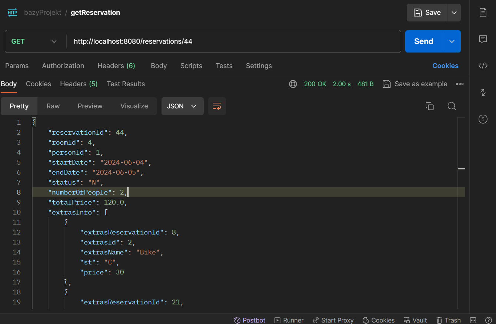

Response

```
{
    "reservationId": 44,
    "roomId": 4,
    "personId": 1,
    "startDate": "2024-06-04",
    "endDate": "2024-06-05",
    "status": "N",
    "numberOfPeople": 2,
    "totalPrice": 120.0,
    "extrasInfo": [
        {
            "extrasReservationId": 8,
            "extrasId": 2,
            "extrasName": "Bike",
            "st": "C",
            "price": 30
        },
        {
            "extrasReservationId": 21,
            "extrasId": 1,
            "extrasName": "Towel",
            "st": "N",
            "price": 5
        }
    ]
}
```

#### 8.1.2 UPDATE

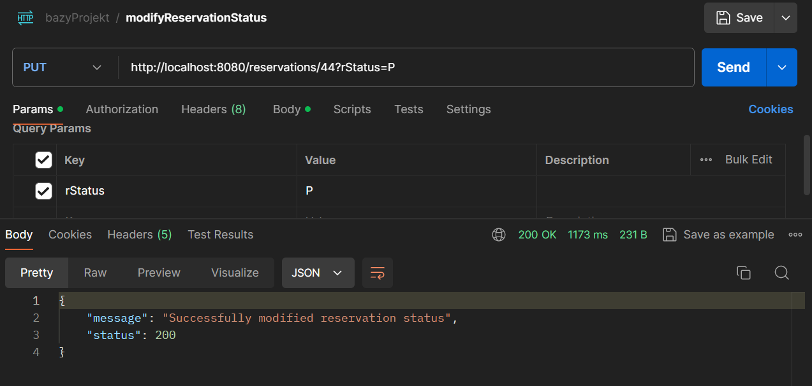

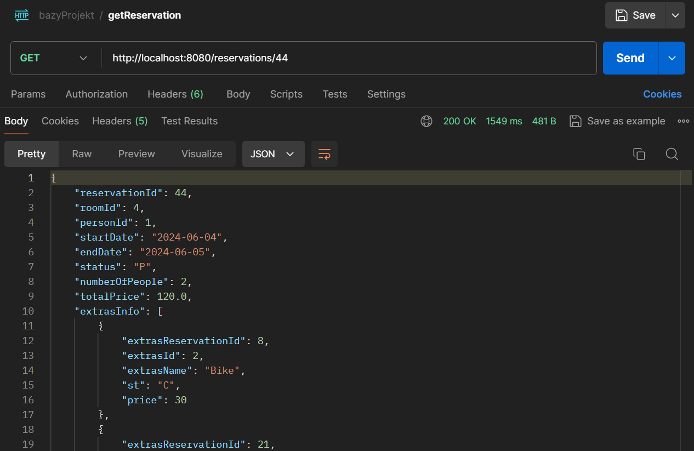

```
{
    "reservationId": 44,
    "roomId": 4,
    "personId": 1,
    "startDate": "2024-06-04",
    "endDate": "2024-06-05",
    "status": "P",
    "numberOfPeople": 2,
    "totalPrice": 120.0,
    "extrasInfo": [
        {
            "extrasReservationId": 8,
            "extrasId": 2,
            "extrasName": "Bike",
            "st": "C",
            "price": 30
        },
        {
            "extrasReservationId": 21,
            "extrasId": 1,
            "extrasName": "Towel",
            "st": "P",
            "price": 5
        }
    ]
}
```

#### 8.1.3 CREATE

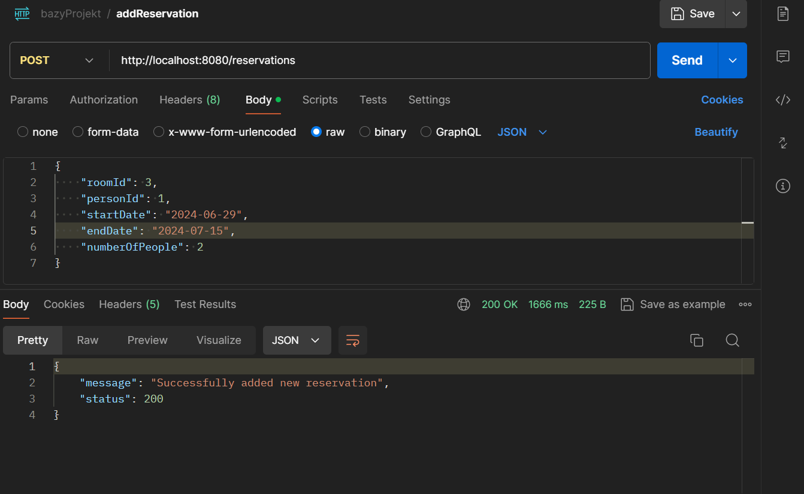

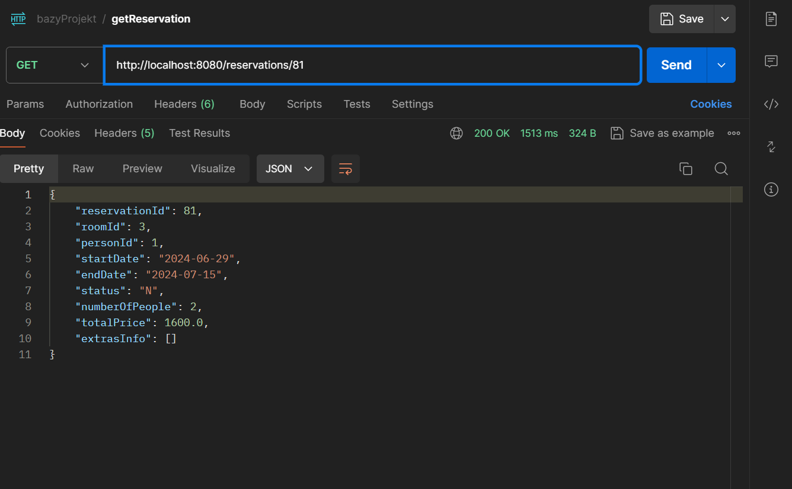

```
{
    "reservationId": 81,
    "roomId": 3,
    "personId": 1,
    "startDate": "2024-06-29",
    "endDate": "2024-07-15",
    "status": "N",
    "numberOfPeople": 2,
    "totalPrice": 1600.0,
    "extrasInfo": []
}
```

### 8.2 Transakcyjność

Spróbujemy zrobić rezerwację nachodzącą na termin przed chwilą stworzonej Rezerwacji

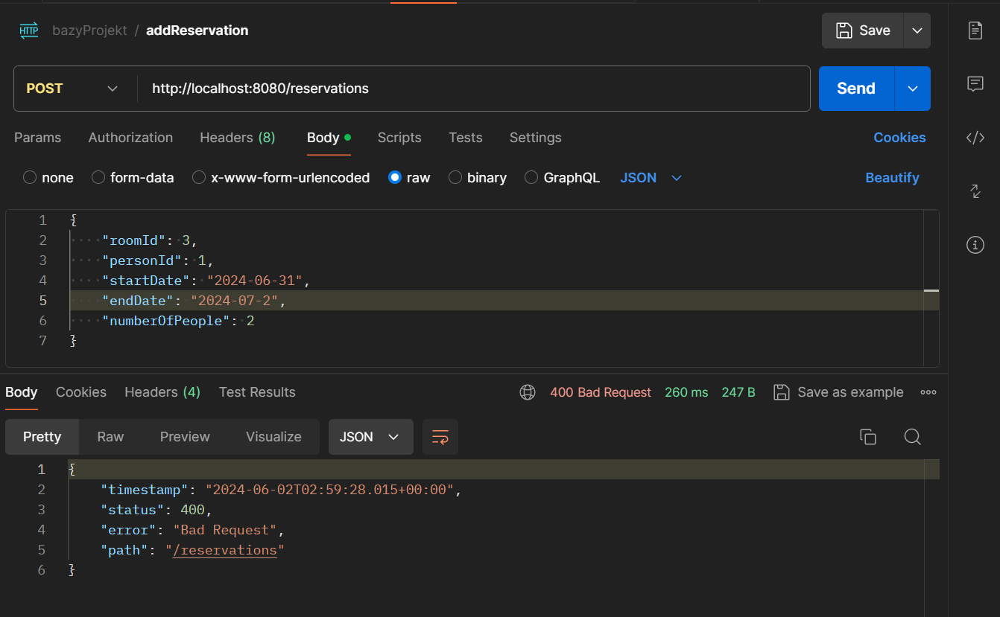

Widać, że akcja się nie powiodła, ponieważ pokój jest już zajęty.

### 8.3 Raportowanie

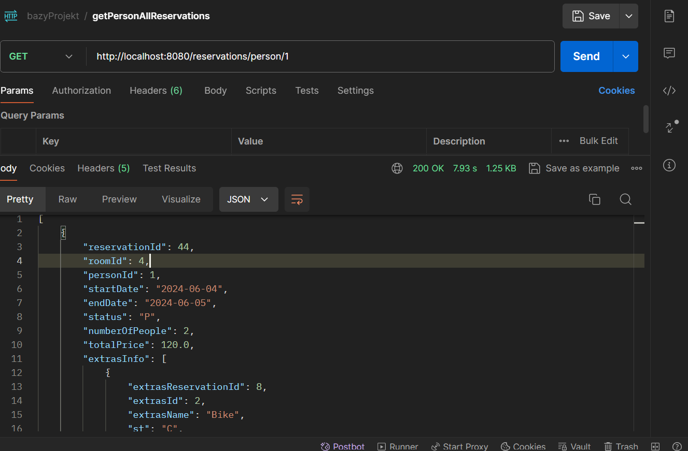

```
[
    {
        "reservationId": 44,
        "roomId": 4,
        "personId": 1,
        "startDate": "2024-06-04",
        "endDate": "2024-06-05",
        "status": "P",
        "numberOfPeople": 2,
        "totalPrice": 120.0,
        "extrasInfo": [
            {
                "extrasReservationId": 8,
                "extrasId": 2,
                "extrasName": "Bike",
                "st": "C",
                "price": 30
            },
            {
                "extrasReservationId": 21,
                "extrasId": 1,
                "extrasName": "Towel",
                "st": "P",
                "price": 5
            }
        ]
    },
    {
        "reservationId": 63,
        "roomId": 4,
        "personId": 1,
        "startDate": "2024-06-21",
        "endDate": "2024-06-28",
        "status": "N",
        "numberOfPeople": 2,
        "totalPrice": 700.0,
        "extrasInfo": []
    },
    {
        "reservationId": 8,
        "roomId": 1,
        "personId": 1,
        "startDate": "2024-05-22",
        "endDate": "2024-05-31",
        "status": "P",
        "numberOfPeople": 2,
        "totalPrice": 900.0,
        "extrasInfo": []
    },
    {
        "reservationId": 66,
        "roomId": 3,
        "personId": 1,
        "startDate": "2024-06-21",
        "endDate": "2024-06-28",
        "status": "N",
        "numberOfPeople": 2,
        "totalPrice": 700.0,
        "extrasInfo": []
    },
    {
        "reservationId": 23,
        "roomId": 1,
        "personId": 1,
        "startDate": "2024-06-01",
        "endDate": "2024-06-03",
        "status": "P",
        "numberOfPeople": 2,
        "totalPrice": 200.0,
        "extrasInfo": []
    },
    {
        "reservationId": 81,
        "roomId": 3,
        "personId": 1,
        "startDate": "2024-06-29",
        "endDate": "2024-07-15",
        "status": "N",
        "numberOfPeople": 2,
        "totalPrice": 1600.0,
        "extrasInfo": []
    }
]
```

Mamy tu złożone zapytanie, które pokazuje zbiorowo wszystkie rezerwacje użytkownika wraz z detalami.
